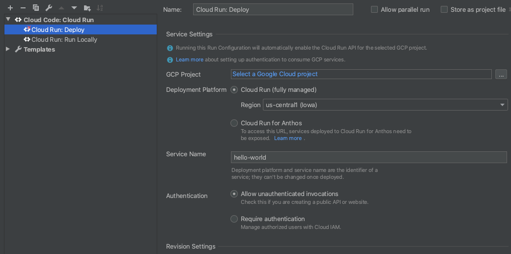

# Cloud Run Hello World with Cloud Code

This "Hello World" sample demonstrates how to deploy a simple "Hello World" application to Cloud Run using the [Cloud Code extension for IntelliJ](https://cloud.google.com/code/docs/intellij/install).

### Table of Contents
* [Getting Started](#getting-started)
    1. [Run the app locally with the Cloud Run Emulator](#run-the-app-locally-with-the-cloud-run-emulator)
       * [Define run configuration](#define-run-configuration)
       * [Run the application](#run-the-application) 
    2. [Deploy to Cloud Run](#deploy-to-cloud-run)
* [Next steps](#next-steps)

---
## Getting Started

### Run the app locally with the Cloud Run Emulator

#### Define run configuration

1. Click the Run/Debug configurations dropdown on the top taskbar and select 'Edit Configurations'. 

2. Select 'Cloud Run: Run Locally' and specify your [builder option](https://cloud.google.com/code/docs/intellij/developing-a-cloud-run-app#defining_your_run_configuration). Cloud Code supports Docker, Jib, and Buildpacks. See the skaffold documentation on [builders](https://skaffold.dev/docs/pipeline-stages/builders/) for more information about build artifact types.  

#### Run the application
1. Click the Run/Debug configurations dropdown and select 'Cloud Run: Run Locally'. Click the run icon.  

2. View the build process in the output window. Once the build has finished, you will receive a notification from the Event Log. Click 'View' to access the local URLs for your deployed services.

### Deploy to Cloud Run
#### Define run configuration

1. Click the Run/Debug configurations dropdown on the top taskbar and select 'Edit Configurations'. 

2. Select 'Cloud Run: Deploy'. Set your Google Cloud project ID, logging into your Google account if prompted. For more information on configuration settings, see [Defining your run configuration](https://cloud.google.com/code/docs/intellij/deploying-a-cloud-run-app#defining_your_run_configuration).

#### Run the application
1. Click the Run/Debug configurations dropdown and select 'Cloud Run: Deploy'. Click the run icon.  

2. View the build process in the output window. Once the build has finished, you will receive a notification with the URL for your deployed service.

---
## Next steps
* [Create a new Cloud Run app](https://cloud.google.com/code/docs/intellij/quickstart-cloud-run)
* [Use the Cloud Run Explorer](https://cloud.google.com/code/docs/intellij/cloud-run-explorer)
* [Manage Cloud APIs and client libraries](https://cloud.google.com/code/docs/intellij/client-libraries)
* [Manage secrets with Secret Manager](https://cloud.google.com/code/docs/intellij/secret-manager)
* [Debug the app](https://cloud.google.com/code/docs/intellij/debugging-a-cloud-run-app)
* [View Container Logs](https://cloud.google.com/code/docs/intellij/logging-a-k8-app)

----