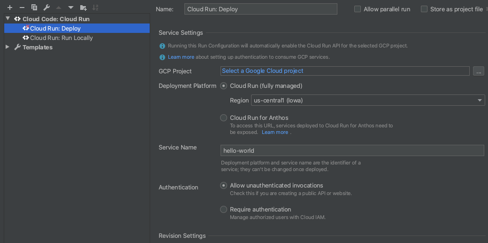

# Cloud Run Hello World with Cloud Code

This "Hello World" sample demonstrates how to deploy a simple "Hello World" application to Cloud Run using the [Cloud Code extension for IntelliJ](https://cloud.google.com/code/docs/intellij/install?utm_source=ext&utm_medium=partner&utm_campaign=CDR_kri_gcp_cloudcodereadmes_012521&utm_content=-).

### Table of Contents
* [Getting Started](#getting-started)
    1. [Run the app locally with the Cloud Run Emulator](#run-the-app-locally-with-the-cloud-run-emulator)
       * [Define run configuration](#define-run-configuration)
       * [Run the application](#run-the-application) 
    2. [Deploy to Cloud Run](#deploy-to-cloud-run)
* [Next steps](#next-steps)
* [Sign up for User Research](#sign-up-for-user-research)
* [Getting support](#getting-support)

---
<h2 id="getting-started"> Getting Started </h2>

<h3 id="run-the-app-locally-with-the-cloud-run-emulator"> Run the app locally with the Cloud Run Emulator</h3>

<h4 id="define-run-configuration"> Define run configuration</h4>

1. Click the Run/Debug configurations dropdown on the top taskbar and select 'Edit Configurations'. 

2. Select 'Cloud Run: Run Locally' and specify your [builder option](https://cloud.google.com/code/docs/intellij/developing-a-cloud-run-app#defining_your_run_configuration?utm_source=ext&utm_medium=partner&utm_campaign=CDR_kri_gcp_cloudcodereadmes_012521&utm_content=-). Cloud Code supports Docker, Jib, and Buildpacks. See the skaffold documentation on [builders](https://skaffold.dev/docs/pipeline-stages/builders/) for more information about build artifact types.  

<h4 id="run-the-application"> Run the application</h4>

1. Click the Run/Debug configurations dropdown and select 'Cloud Run: Run Locally'. Click the run icon.  

2. View the build process in the output window. Once the build has finished, you will receive a notification from the Event Log. Click 'View' to access the local URLs for your deployed services.  

<h3 id="deploy-to-cloud-run"> Deploy to Cloud Run</h3>
<h4 id="define-run-configuration"> Define run configuration</h4>

1. Click the Run/Debug configurations dropdown on the top taskbar and select 'Edit Configurations'.  

2. Select 'Cloud Run: Deploy'. Set your Google Cloud project ID, logging into your Google account if prompted. For more information on configuration settings, see [Defining your run configuration](https://cloud.google.com/code/docs/intellij/deploying-a-cloud-run-app#defining_your_run_configuration?utm_source=ext&utm_medium=partner&utm_campaign=CDR_kri_gcp_cloudcodereadmes_012521&utm_content=-).  

<h4 id="run-the-application"> Run the application</h4>

1. Click the Run/Debug configurations dropdown and select 'Cloud Run: Deploy'. Click the run icon.  

2. View the build process in the output window. Once the build has finished, you will receive a notification with the URL for your deployed service.  

---
<h2 id="next-steps"> Next steps</h2>

* Try [debugging your app](https://cloud.google.com/code/docs/intellij/debugging-a-cloud-run-app?utm_source=ext&utm_medium=partner&utm_campaign=CDR_kri_gcp_cloudcodereadmes_012521&utm_content=-) using Cloud Code
* Nagivate the [Cloud Run Explorer](https://cloud.google.com/code/docs/intellij/cloud-run-explorer?utm_source=ext&utm_medium=partner&utm_campaign=CDR_kri_gcp_cloudcodereadmes_012521&utm_content=-)
* View [streaming logs](https://cloud.google.com/code/docs/intellij/viewing-cloud-run-logs?utm_source=ext&utm_medium=partner&utm_campaign=CDR_kri_gcp_cloudcodereadmes_012521&utm_content=-)
* Enable [Cloud APIs and client libraries](https://cloud.google.com/code/docs/intellij/client-libraries?utm_source=ext&utm_medium=partner&utm_campaign=CDR_kri_gcp_cloudcodereadmes_012521&utm_content=-)
* Manage secrets with [Secret Manager](https://cloud.google.com/code/docs/intellij/secret-manager?utm_source=ext&utm_medium=partner&utm_campaign=CDR_kri_gcp_cloudcodereadmes_012521&utm_content=-)

For more Cloud Code tutorials and resources, check out [Awesome Cloud Code](https://github.com/russwolf/awesome-cloudclode)!

---
<h2 id="sign-up-for-user-research"> Sign up for User Research</h2>

We want to hear your feedback!

The Cloud Code team is inviting our user community to sign-up to participate in Google User Experience Research. 

If you’re invited to join a study, you may try out a new product or tell us what you think about the products you use every day. At this time, Google is only sending invitations for upcoming remote studies. Once a study is complete, you’ll receive a token of thanks for your participation such as a gift card or some Google swag. 

[Sign up using this link](https://google.qualtrics.com/jfe/form/SV_4Me7SiMewdvVYhL?reserved=1&utm_source=In-product&Q_Language=en&utm_medium=own_prd&utm_campaign=Q1&productTag=clou&campaignDate=January2021&referral_code=UXbT481079) and answer a few questions about yourself, as this will help our research team match you to studies that are a great fit.

----

<h2 id="getting-support"> Getting support</h2>

If you encounter any bugs, confusing commands, or unclear documentation, you can file your feedback [directly on GitHub](https://github.com/GoogleCloudPlatform/cloud-code-intellij/issues).

If you'd like to propose a feature idea or have an open-ended discussion about a question you have with the Cloud Code team and the community, you can post on the [Cloud Code GitHub discussions forum](https://github.com/GoogleCloudPlatform/cloud-code-intellij/discussions).

Ask a question about Cloud Code on [Stack Overflow](http://stackoverflow.com/questions/tagged/cloud-code-intellij). Use the tag `google-cloud-intellij` for questions about Cloud Code. This tag not only receives responses from the Stack Overflow community, but also from Google engineers, who monitor the tag and offer unofficial support.
