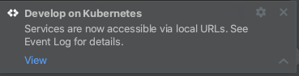
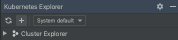
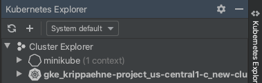

# Kubernetes Hello World with Cloud Code

This "Hello World" sample demonstrates how to deploy a simple "Hello World" application to Kubernetes using the [Cloud Code extension for IntelliJ](https://cloud.google.com/code/docs/intellij/install).

### Table of Contents
* [Getting Started](#getting-started)
    1. [Run the app locally with minikube](#run-the-app-locally-with-minikube)
        * [Start a minikube cluster](#start-a-minikube-cluster)
        * [Run the app on minikube](#run-the-app-on-minikube)
    2. [Run the app remotely with Google Kubernetes Engine](#run-the-app-remotely-with-google-kubernetes-engine)
        * [Set up a GKE cluster](#set-up-a-gke-cluster)
        * [Deploy app to GKE](#deploy-app-to-gke)
* [Next steps](#next-steps)

---
## Getting Started

### Run the app locally with minikube

#### Start a minikube cluster
1. Navigate to the Kubernetes Explorer from the right side panel. If your Cluster Explorer is empty, go to the terminal and run 'minikube start'. 

2. Once minikube has started, it will be displayed in the Cluster Explorer.
 

#### Run the app on minikube
1. Click the Run/Debug configurations dropdown on the top taskbar and select 'Edit Configurations'. Select 'Develop on Kubernetes' and specify your [container image repository](https://cloud.google.com/code/docs/intellij/configuring-container-image-settings), then click 'OK'.

2. Select 'Develop on Kubernetes' from the configuration drop down and click the run icon. 

2. View the build process in the output window. Once the build has finished, you will receive a notification from the Event Log. Click 'View' to access the local URLs for your deployed services.  

3.  To stop the application, click the stop icon next to the configuration dropdown.

---
### Run the app remotely on Google Kubernetes Engine

#### Set up a GKE cluster

1. Navigate to the Kubernetes Explorer from the right side panel.

2. Click '+' to create a new cluster. If prompted, log in to your GCP account and select a project.

3. Click 'Create a new GKE cluster`. You will be directed to the Google Cloud Console to create your new cluster.

4. Once your GKE cluster has been created, it will be displayed in the Cluster Explorer. 

5. Your new cluster will be set as the current context by default. To switch contexts, right click on a different cluster in the Cluster Explorer and select 'Set as Current Context'. 

#### Deploy app to GKE

1. Select 'Run on Kubernetes' from the configuration drop down and click the 'Run' button.

2. View the build process in the output window. Once the build has finished, you will receive a notification from the Event Log. Click 'View' to access the local URLs for your deployed services.  

---
## Next steps
* [Configure an existing app to run on Cloud Code](https://cloud.google.com/code/docs/intellij/using-a-k8-existing-app)
* [Edit YAML files](https://cloud.google.com/code/docs/intellij/yaml-editing)
* [Use the Kubernetes Engine Explorer](https://cloud.google.com/code/docs/intellij/using-the-kubernetes-explorer)
* [Manage Cloud APIs and client libraries](https://cloud.google.com/code/docs/intellij/client-libraries)
* [Manage secrets with Secret Manager](https://cloud.google.com/code/docs/intellij/secret-manager)
* [Debug your app](https://cloud.google.com/code/docs/intellij/kubernetes-debugging)
* [View Container Logs](https://cloud.google.com/code/docs/intellij/logging-a-k8-app)

----