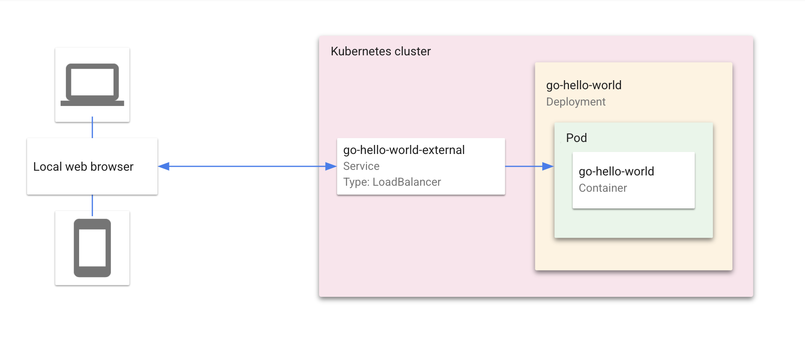

# Kubernetes Hello World with Cloud Code

This "Hello World" sample demonstrates how to deploy a simple "Hello World" application to Kubernetes using the [Cloud Code extension for IntelliJ](https://cloud.google.com/code/docs/intellij/install?utm_source=ext&utm_medium=partner&utm_campaign=CDR_kri_gcp_cloudcodereadmes_012521&utm_content=-). When you run the application, Cloud Code uses [skaffold](https://skaffold.dev/docs/) under the hood to build an image and deploy the project's Kubernetes manifests. To learn more about Kubernetes, explore the [Kubernetes overview](https://kubernetes.io/docs/concepts/overview/).

### Table of Contents
* [What's in this sample](#whats-in-this-sample)
* [Getting Started](#getting-started)
    1. [Run the app locally with minikube](#run-the-app-locally-with-minikube)
        * [Edit run configuration](#edit-run-configuration)
        * [Run the app on minikube](#run-the-app-on-minikube)
    2. [Run the app remotely with Google Kubernetes Engine](#run-the-app-remotely-with-google-kubernetes-engine)
        * [Set up a GKE cluster](#set-up-a-gke-cluster)
        * [Deploy app to GKE](#deploy-app-to-gke)
* [Next steps](#next-steps)
* [Sign up for User Research](#sign-up-for-user-research)
* [Getting support](#getting-support)

---
## What's in this sample
### Kubernetes architecture

### Directory contents

- `skaffold.yaml` - A schema file that defines skaffold configurations ([skaffold.yaml reference](https://skaffold.dev/docs/references/yaml/))
- `kubernetes-manifests/` - Contains Kubernetes YAML files for the Guestbook services and deployments, including:

  - `hello.deployment.yaml` - deploys a pod with the 'go-hello-world' container image
  - `hello.service.yaml` - creates a load balancer and exposes the 'go-hello-world' service on an external IP in the cluster

---
## Getting Started

### Run the app locally with minikube

#### Edit run configuration
1. Click the Run/Debug Configurations dropdown on the top taskbar and select 'Edit Configurations'.    

2. In the Run/Debug Configurations dialog, select 'Develop on Kubernetes'. This configuration watches for changes, then uses [skaffold](https://skaffold.dev/docs/) to rebuild and rerun your app.

3. Under **Run > Deployment**, select 'Deploy locally to a minikube cluster'.

4. Click 'OK' to save your configuration. 

#### Run the app on minikube
1. Select 'Develop on Kubernetes' from the configuration drop down and click the run icon. Cloud Code runs your app in a local [minikube](ttps://minikube.sigs.k8s.io/docs/start/) cluster.  

2. View the build process in the output window. Once the build has finished, you will receive a notification from the Event Log. Click 'View' to access the local URLs for your deployed services. The URLs remain accessible through the Event Log dialog.  

3. To stop the application, click the stop icon next to the configuration dropdown.

---
### Run the app remotely on Google Kubernetes Engine

#### Set up a GKE cluster

1. Navigate to the Kubernetes Explorer from the right side panel, or by going to **Tools > Cloud Code > Kubernetes > View Cluster Explorer**. 

2. Click '+' to create a new cluster, or go to **Tools > Cloud Code > Kubernetes > Add GKE Cluster**.   

3. If prompted, log in to your GCP account and select a project.  

4. Click 'Create a new GKE cluster`. You will be directed to the Google Cloud Console to create your new cluster.  

5. Once your GKE cluster has been created, it will be displayed in the Cluster Explorer.   

6. Your new cluster will be set as the current context by default. To switch contexts, right click on a different cluster in the Cluster Explorer and select 'Set as Current Context'. 

#### Deploy app to GKE

1. Select 'Run on Kubernetes' from the configuration drop down and click the 'Run' button.  

2. View the build process in the output window. Once the build has finished, you will receive a notification from the Event Log. Click 'View' to access the local URLs for your deployed services. The URLs remain accessible through the Event Log dialog.  

---
## Next steps
* Try [debugging your app](https://cloud.google.com/code/docs/intellij/kubernetes-debugging?utm_source=ext&utm_medium=partner&utm_campaign=CDR_kri_gcp_cloudcodereadmes_012521&utm_content=-) using Cloud Code
* Navigate the [Kubernetes Engine Explorer](https://cloud.google.com/code/docs/intellij/using-the-kubernetes-explorer?utm_source=ext&utm_medium=partner&utm_campaign=CDR_kri_gcp_cloudcodereadmes_012521&utm_content=-)
* Learn how to [edit YAML files](https://cloud.google.com/code/docs/intellij/yaml-editing?utm_source=ext&utm_medium=partner&utm_campaign=CDR_kri_gcp_cloudcodereadmes_012521&utm_content=-) to deploy your Kubernetes app
* [Configure an existing app](https://cloud.google.com/code/docs/intellij/using-a-k8-existing-app?utm_source=ext&utm_medium=partner&utm_campaign=CDR_kri_gcp_cloudcodereadmes_012521&utm_content=-) to run on Cloud Code
* Enable [Cloud APIs and client libraries](https://cloud.google.com/code/docs/intellij/client-libraries?utm_source=ext&utm_medium=partner&utm_campaign=CDR_kri_gcp_cloudcodereadmes_012521&utm_content=-)
* Manage secrets with [Secret Manager](https://cloud.google.com/code/docs/intellij/secret-manager?utm_source=ext&utm_medium=partner&utm_campaign=CDR_kri_gcp_cloudcodereadmes_012521&utm_content=-)

For more Cloud Code tutorials and resources, check out [Awesome Cloud Code](https://github.com/russwolf/awesome-cloudclode)!

---
## Sign up for User Research

We want to hear your feedback!

The Cloud Code team is inviting our user community to sign-up to participate in Google User Experience Research. 

If you’re invited to join a study, you may try out a new product or tell us what you think about the products you use every day. At this time, Google is only sending invitations for upcoming remote studies. Once a study is complete, you’ll receive a token of thanks for your participation such as a gift card or some Google swag. 

[Sign up using this link](https://google.qualtrics.com/jfe/form/SV_4Me7SiMewdvVYhL?reserved=1&utm_source=In-product&Q_Language=en&utm_medium=own_prd&utm_campaign=Q1&productTag=clou&campaignDate=January2021&referral_code=UXbT481079) and answer a few questions about yourself, as this will help our research team match you to studies that are a great fit.

---

## Getting support

If you encounter any bugs, confusing commands, or unclear documentation, you can file your feedback [directly on GitHub](https://github.com/GoogleCloudPlatform/cloud-code-intellij/issues).

If you'd like to propose a feature idea or have an open-ended discussion about a question you have with the Cloud Code team and the community, you can post on the [Cloud Code GitHub discussions forum](https://github.com/GoogleCloudPlatform/cloud-code-intellij/discussions).

Ask a question about Cloud Code on [Stack Overflow](http://stackoverflow.com/questions/tagged/cloud-code-intellij). Use the tag `google-cloud-intellij` for questions about Cloud Code. This tag not only receives responses from the Stack Overflow community, but also from Google engineers, who monitor the tag and offer unofficial support.
