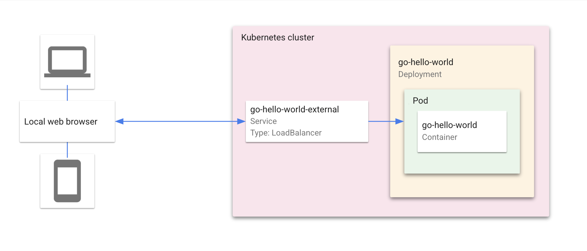

# Hello World with Cloud Code



"Hello World" is a simple Kubernetes application that contains a single
[Deployment](https://kubernetes.io/docs/concepts/workloads/controllers/deployment/) and a corresponding
[Service](https://kubernetes.io/docs/concepts/services-networking/service/). The Deployment contains a
 web server that simply prints "Hello World".

----

## Table of Contents

* [VS Code Guide](#vs-code-guide)
    1. [Getting Started](#vs-code-getting-started)
    2. [What's in the box](https://cloud.google.com/code/docs/vscode/quickstart#whats_in_the_box)
* [IntelliJ Guide](#intellij-guide)
    1. [Getting Started](#intellij-getting-started)
    2. [What's in the box](https://cloud.google.com/code/docs/intellij/quickstart#whats_in_the_box)    
* [Using the Command Line](#using-the-command-line)

----

## VS Code Guide

### VS Code Getting Started

This sample was written to demonstrate how to use the Cloud Code extension for Visual Studio Code.

* [Install Cloud Code for VS Code](https://cloud.google.com/code/docs/vscode/install)
* [Creating a new app](https://cloud.google.com/code/docs/vscode/creating-an-application)
* [Editing YAML files](https://cloud.google.com/code/docs/vscode/yaml-editing)

### Using Cloud Code
* [Set up a Google Kubernetes Engine Cluster](https://cloud.google.com/code/docs/vscode/quickstart#creating_a_google_kubernetes_engine_cluster)
* [Running the app](https://cloud.google.com/code/docs/vscode/quickstart#running_your_app)
* [Debug the app](https://cloud.google.com/code/docs/vscode/quickstart#debugging_your_app)
* [View Container Logs](https://cloud.google.com/code/docs/vscode/quickstart#viewing_logs)
* [Open a Terminal in Your Container](https://cloud.google.com/code/docs/vscode/quickstart#bonus_opening_a_terminal_in_your_container)
----

## IntelliJ Guide

### IntelliJ Getting Started

This sample was written to demonstrate how to use the Cloud Code plugin for IntelliJ.

* [Install Cloud Code for IntelliJ](https://cloud.google.com/code/docs/intellij/install)
* [Creating a new app](https://cloud.google.com/code/docs/intellij/creating-a-k8-app)
* [Editing YAML files](https://cloud.google.com/code/docs/intellij/yaml-editing)

### Using Cloud Code
* [Creating an app](https://cloud.google.com/code/docs/intellij/quickstart-k8s#creating_an_application)
* [Develop an app](https://cloud.google.com/code/docs/intellij/quickstart-k8s#developing_your_application)
* [Debug an app](https://cloud.google.com/code/docs/intellij/quickstart-k8s#debugging_your_application)
* [View Container Logs](https://cloud.google.com/code/docs/intellij/quickstart-k8s#viewing_logs)
----

## Using the Command Line

As an alternative to using Cloud Code, the application can be deployed to a cluster using standard command line tools

#### Skaffold

[Skaffold](https://github.com/GoogleContainerTools/skaffold) is a command line tool that can be used to build, push, and deploy your container images

```bash
skaffold run --default-repo=gcr.io/YOUR-PROJECT-ID-HERE/cloudcode
```

#### kubectl

[kubectl](https://kubernetes.io/docs/tasks/tools/install-kubectl/) is the official Kubernetes command line tool. It can be used to deploy Kubernetes manifests to your cluster, but images must be build separately using another tool (for example, using the [Docker CLI](https://docs.docker.com/engine/reference/commandline/cli/))
