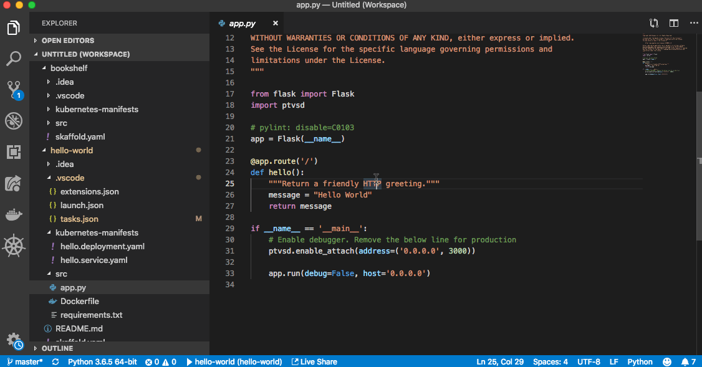

# Hello World

"Hello World" is a simple Kubernetes application that contains a single
[Deployment](https://kubernetes.io/docs/concepts/workloads/controllers/deployment/) and a corresponding 
[Service](https://kubernetes.io/docs/concepts/services-networking/service/). The Deployment contains a 
[Flask-based](http://flask.pocoo.org/) web server that simply prints "Hello World".

## Getting Started
This sample was written to demonstrate how to use the CloudCode extension for Visual Studio code. Instructions for installing the instructions can be 
[found here.](https://github.com/GoogleCloudPlatform/vscode-extensions-docs/blob/master/getting_started.md) 
CloudCode requires [Skaffold](https://github.com/GoogleContainerTools/skaffold) to be installed to build and deploy container images.

## Included Files
- .vscode
  - `extensions.json`: prompts Visual Studio Code users to download the related extensions when opening this project
  - `launch.json`: information needed for the debugger to attach to our service
  - `tasks.json`: config information for [Visual Studio Code Tasks](https://code.visualstudio.com/docs/editor/tasks)
- kubernetes-manifests
  - `hello.deployment.yaml`: Kubernetes manifest for the Hello World Deployment
  - `hello.service.yaml`: Kubernetes manifest for the Hello World LoadBalancer Service
- src
  - `app.py`: Python code with the web server logic
  - `Dockerfile`: used to build the container image for our program
  - `requirements.txt`: describe the required Python dependencies
- `skaffold.yaml`: config file for [Skaffold](https://github.com/GoogleContainerTools/skaffold), which is used by CloudCode to build and deploy images

## Using CloudCode
### Set up a GKE Cluster
- Open the [Command Palette](https://code.visualstudio.com/docs/getstarted/userinterface#_command-palette)
- Type "CloudCode: Create GKE cluster"
- CloudCode will open a UI to enter your GCP information
- When finished, you will see your cluster listed under the [GKE Explorer view](https://github.com/GoogleCloudPlatform/vscode-extensions-docs/blob/master/gke_explorer.md)

### Deployment
- Open the [Command Palette](https://code.visualstudio.com/docs/getstarted/userinterface#_command-palette)
- Type "CloudCode: Deploy"
- Select "hello-world" as the application to deploy
- Select "local" to build containers using your local Docker, or "staging" to build using [Google Cloud Build](https://cloud.google.com/cloud-build/)
- An output window will appear showing the results of your deployment
- When complete, the output window will display an IP address you can use to access your service over the internet


#### Continuous Deployment
- Open the [Command Palette](https://code.visualstudio.com/docs/getstarted/userinterface#_command-palette)
- Type "CloudCode: Deploy"
- Select "hello-world" as the application to deploy
- Select "local" to build containers using your local Docker, or "staging" to build using [Google Cloud Build](https://cloud.google.com/cloud-build/)
- An output window will appear showing the results of your deployment
- Now, update the message returned by the server in app.py and save the file. CloudCode will notice the change and automatically push and deploy a new version of your application automatically
### Container Logs
- Open the [Command Palette](https://code.visualstudio.com/docs/getstarted/userinterface#_command-palette)
- Type "CloudCode: View Logs"
- Select the pod you wish to see the logs from
- A new file will open populated with the standard output of the hello-world container


### Debugger
- Open [Debug view](https://code.visualstudio.com/Docs/editor/debugging)
- Select "hello-world" as the debug configuration in the dropdown menu
- Press the debug start button to attach a debugger session to the hello-world application
  - CloudCode usses the .vscode/launch.json file to locate the pods to attach a debug session to
  - the hello-world container was built to run `ptvsd` to support debugging
- You should see the [Debug toolbar](https://code.visualstudio.com/Docs/editor/debugging#_debug-actions) with familiar debug controls
- You can click in the margin in `app.py` to add a breakpoint. When you send a new request to your application, it will pause at the desired line
- You can inspect variables and stack info in the [Debug Side Bar](https://code.visualstudio.com/Docs/editor/debugging)
- You can interact with the debugging session using the [Debug Console](https://code.visualstudio.com/Docs/editor/debugging#_debug-console-repl) in the bottom pane


### Container Terminal
- Open the [Command Palette](https://code.visualstudio.com/docs/getstarted/userinterface#_command-palette)
- Type "CloudCode: Get Terminal"
- Select the pod you wish to connect to
- You now have access to a shell inside the running container


### Tasks
This sample also includes a number of [Visual Studio Code Tasks](https://code.visualstudio.com/docs/editor/tasks) to launch common commands

#### Pylint Task
- [Install Pylint](https://www.pylint.org/#install) if necessary
- Open the [Command Palette](https://code.visualstudio.com/docs/getstarted/userinterface#_command-palette)
- Type "Tasks: Run Task"
- Select the "Pylint" task
- An output window will appear showing the Pylint output


## Running Through the Command Line
As an alternative to using CloudCode, the application can be deployed to a cluster using standard command line tools

### Using Skaffold
```
skaffold run
```

### Using kubectl

#### Build Container Images:
```
IMAGE_REPO="gcr.io/your-project-here/"
docker build -t $IMAGE_REPO/hello-world ./src
docker push $IMAGE_REPO/hello-world
```
#### Deploy Manifests
Note that you may need to edit hello.deployment.yaml's image field to match `$IMAGE_REPO/hello-world`
```
kubectl apply -f ./kubernetes-manifests
```
