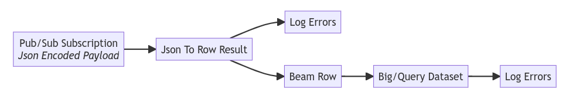

# Overview

This sample demonstrates using [Apache Beam](https://beam.apache.org/) on [Dataflow](https://cloud.google.com/dataflow)
to convert JSON encoded Pub/Sub subscription message strings into structured data and write that data to a BigQuery.

# Important Requirements

To run this sample, it requires:

1. Java 11
2. [Google Cloud SDK](https://cloud.google.com/sdk); `gcloud init`
  and `gcloud auth`
3. Google Cloud project with billing enabled
4. Provision required resources by clicking the button.

[](https://shell.cloud.google.com/cloudshell/editor?cloudshell_git_repo=https%3A%2F%2Fgithub.com%2FGoogleCloudPlatform%2Fcloud-code-samples&cloudshell_git_branch=v1&cloudshell_tutorial=cloud-shell-readme.md&cloudshell_working_dir=java%2Fjava-dataflow-samples%2Fread-pubsub-write-bigquery&show=terminal)

5. gradle.properties file - The previous requirement will generate this for you. If you would like to generate yourself: See template: [java/java-dataflow-samples/read-pubsub-write-bigquery/infrastructure/03.io
/gradle.properties.tmpl](infrastructure/03.io/gradle.properties.tmpl)

## Table of Contents
* [Important Assumptions](#important-assumptions)
* [What's in this sample](#whats-in-this-sample)
* [Getting Started with Intellij](#getting-started-with-intellij)
* [Sign up for User Research](#sign-up-for-user-research)

# Important Assumptions

Successful [Apache Beam](https://beam.apache.org/) pipelines rely on what's called a schema, a description of the
expected data structure, its field names and data types.
Therefore, this sample assumes:
- Pub/Sub Subscription messages encoded as JSON strings adhere to the
`projects/pubsub-public-data/topics/taxirides-realtime`.  An example of such data is shown below.
```json
{  "ride_id": "36a1c3e4-eb3b-451b-81ce-13be8e2f6e6c",  "point_idx": 1042,  "latitude": 40.721470000000004,  "longitude": -73.82676000000001,  "timestamp": "2023-02-08T14:02:34.28351-05:00",  "meter_reading": 23.425806,  "meter_increment": 0.02248158,  "ride_status": "enroute",  "passenger_count": 2}
```


# What's in this sample

## Beam Pipeline sample

The enclosed [Apache Beam](https://beam.apache.org/) pipeline demonstrates how
Beam solves a common problem of decoding and encoding when reading from and
writing to various sources and sinks.  Data stored in one resource is encoded in a format
incompatible with another resource.

[Apache Beam](https://beam.apache.org/) unifies several incompatible resources with a single model called a
[Row](https://beam.apache.org/releases/javadoc/current/org/apache/beam/sdk/values/Row.html) and a
[Schema](https://beam.apache.org/releases/javadoc/current/org/apache/beam/sdk/schemas/Schema.html)
that describes a Row's field names and field types.

This pipeline sample specifically reads JSON encoded Pub/Sub message strings, converts these
records into structured data representations.  Finally, the pipeline writes these structured records into a BigQuery
table.

The figure below diagrams this pipeline.



# Getting Started with IntelliJ

TODO

# Sign up for User Research

TODO
