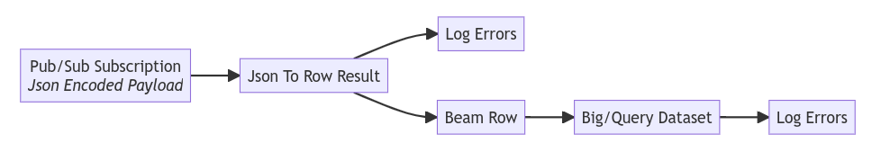
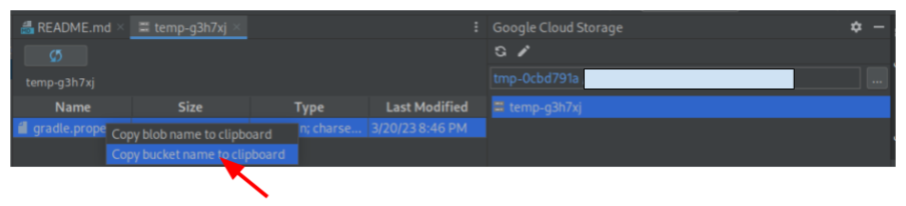
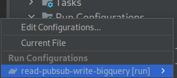
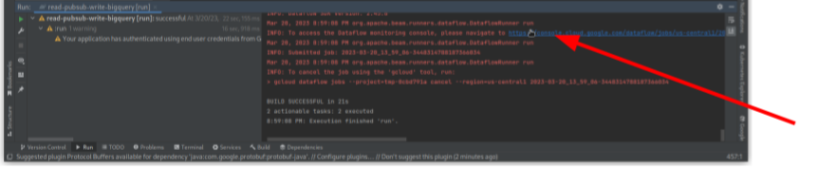
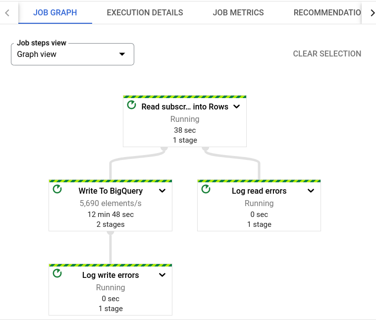
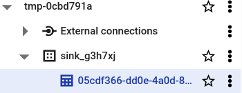
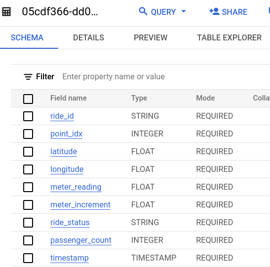
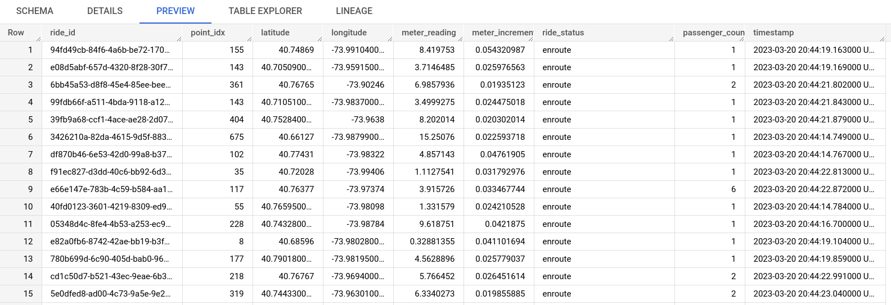

# Overview

This sample demonstrates using [Apache Beam](https://beam.apache.org/) on [Dataflow](https://cloud.google.com/dataflow)
to convert JSON encoded Pub/Sub subscription message strings into structured data and write that data to a BigQuery.

# Important Requirements

To run this sample, it requires:

1. Sign in to the Google Cloud Platform
(From the Menu select:
`Tools -> Google Cloud Code -> Sign in to Google Cloud Platform`)
2. Set Google Cloud SDK configuration to billable project
(From the Menu select:
`Tools -> Google Cloud Code -> Tools -> Cloud Code Terminal` and
run `gcloud config set project <Your Google Cloud Project ID>`)
3. Java 11
4. Google Cloud project with billing enabled
5. Provision required resources by clicking the button.

[](https://shell.cloud.google.com/cloudshell/editor?cloudshell_git_repo=https%3A%2F%2Fgithub.com%2FGoogleCloudPlatform%2Fcloud-code-samples&cloudshell_git_branch=v1&cloudshell_tutorial=cloud-shell-readme.md&cloudshell_working_dir=java%2Fjava-dataflow-samples%2Fread-pubsub-write-bigquery&show=terminal)

4. gradle.properties file - The previous requirement will generate this for you. If you would like to generate yourself: See template:
[infrastructure/03.io/gradle.properties.tmpl](infrastructure/03.io/gradle.properties.tmpl)

## Table of Contents
* [Important Assumptions](#important-assumptions)
* [What's in this sample](#whats-in-this-sample)
* [Getting Started with Intellij](#getting-started-with-intellij)
* [Sign up for User Research](#sign-up-for-user-research)

# Important Assumptions

Successful [Apache Beam](https://beam.apache.org/) pipelines rely on what's called a schema, a description of the
expected data structure, its field names and data types.
Therefore, this sample assumes:
- Pub/Sub Subscription messages encoded as JSON strings adhere to the
`projects/pubsub-public-data/topics/taxirides-realtime`.  An example of such data is shown below.
```json
{  "ride_id": "36a1c3e4-eb3b-451b-81ce-13be8e2f6e6c",  "point_idx": 1042,  "latitude": 40.721470000000004,  "longitude": -73.82676000000001,  "timestamp": "2023-02-08T14:02:34.28351-05:00",  "meter_reading": 23.425806,  "meter_increment": 0.02248158,  "ride_status": "enroute",  "passenger_count": 2}
```


# What's in this sample

## Beam Pipeline sample

The enclosed [Apache Beam](https://beam.apache.org/) pipeline demonstrates how
Beam solves a common problem of decoding and encoding when reading from and
writing to various sources and sinks.  Data stored in one resource is encoded in a format
incompatible with another resource.

[Apache Beam](https://beam.apache.org/) unifies several incompatible resources with a single model called a
[Row](https://beam.apache.org/releases/javadoc/current/org/apache/beam/sdk/values/Row.html) and a
[Schema](https://beam.apache.org/releases/javadoc/current/org/apache/beam/sdk/schemas/Schema.html)
that describes a Row's field names and field types.

This pipeline sample specifically reads JSON encoded Pub/Sub message strings, converts these
records into structured data representations.  Finally, the pipeline writes these structured records into a BigQuery
table.

The figure below diagrams this pipeline.



## Walk through the code

Comments exist in the code to walk you through the pipeline from when it reads
a message from Pub/Sub all the way through until it finally writes to BigQuery.

Start your journey at the main method here:
[ReadPubsubWriteBigQuery.java](src/main/java/com/cloudcode/dataflow/ReadPubsubWriteBigQuery.java)

# Getting Started with IntelliJ

The following steps guide you how to use this sample.

## 1. Sign in to the Google Cloud Platform and Configure Billable Project

### 1a. Sign in to Google Cloud Project using the Menu selection
From the Menu select:
`Tools -> Google Cloud Code -> Sign in to Google Cloud Platform`.

### 1b. Set Google Cloud SDK configuration to billable project

From the Menu select:
`Tools -> Google Cloud Code -> Tools -> Cloud Code Terminal`

Execute the following command, where `<Your Google Cloud Project ID>`
is a billable Google Cloud project to which you have the IAM role
to provision resources.

```
gcloud config set project <Your Google Cloud Project ID>
```

## 2. Provision required resources

[](https://shell.cloud.google.com/cloudshell/editor?cloudshell_git_repo=https%3A%2F%2Fgithub.com%2FGoogleCloudPlatform%2Fcloud-code-samples&cloudshell_git_branch=v1&cloudshell_tutorial=cloud-shell-readme.md&cloudshell_working_dir=java%2Fjava-dataflow-samples%2Fread-pubsub-write-bigquery&show=terminal)

## 3. Acquire gradle.properties file

The previous provision required resources step will generate this for you and
download to your machine.  Move this downloaded `gradle.properties` file to your
IDE working directory on your local machine.

### Help, I lost the gradle.properties file

You can simply download it again from Google Cloud storage.  Follow the steps
below.

#### 1. Find the Google Cloud storage bucket containing the `gradle.properties` file.
Cloud Code's Google Cloud Storage allows you to list and view buckets and
objects.  Just locate the `gradle.properties` file and copy the bucket name.


#### 2. Open the Cloud Code terminal 
Open the Cloud Code terminal via
Tools -> Google Cloud Code -> Tools -> Cloud Code Terminal

#### 3. Download the gradle.properties from Google Cloud storage
NOTE: `<bucket>` is the name of the bucket
you copied in the first step above.

```sh
gsutil cp gs://<bucket>/gradle.properties .
```

### Alternative: build the gradle.properties yourself
If you would like to generate yourself: See template: [java/java-dataflow-samples/read-pubsub-write-bigquery/infrastructure/03.io
/gradle.properties.tmpl](infrastructure/03.io/gradle.properties.tmpl).

## 4. Select the included IntelliJ Run Configuration

This sample comes with an [IntelliJ Run Configuration](https://www.jetbrains.com/help/idea/run-debug-configuration.html).
Find it by clicking on "Edit Configurations..." and select it
as shown in the screenshot below.



## 5. Click the Run Button

After selecting the included
[IntelliJ Run Configuration](https://www.jetbrains.com/help/idea/run-debug-configuration.html),
click the green run button as shown in the screenshot blow.


This runs the sample and submits the Dataflow Job to your
Google Cloud project, referencing values in the `gradle.properties`
file.  Best practice is to instead use
[Dataflow templates](https://cloud.google.com/dataflow/docs/concepts/dataflow-templates).
However, this sample provides you the `gradle.properties` file
for convenience.

## 6. Open the Dataflow Job URL printed in the output

After you clicked the run button in the previous step,
you should see output related to submitting the Dataflow Job.
At the end, it will print a URL that you can open to navigate
to your Dataflow Job.



## 7. Examine the Dataflow Job Graph

After opening the Dataflow Job URL provided by the code output,
you should see the Dataflow Job Graph in the Google Cloud console.
The pipeline will take some time before running the code.  There
is no action you need to take here and is just informational.



## 8. Examine data in BigQuery

When the pipeline finally runs, it writes data to a BigQuery table.
Navigate to BigQuery in the Google Cloud console and notice that
the pipeline created a new table.  Note that the Infrastructure-as-Code
created the dataset earlier.



The pipeline also automatically creates the table schema.



Finally, as the pipeline consumes messages from the Pub/Sub subscription,
originating from the public Pub/Sub taxicab topic,
it writes the data into the BigQuery table.  A preview of this is shown
below.



## 9. Clean up Google Cloud Billable Resources

When you are satisfied with the results of executing the Dataflow Job,
the following lists instructions on deleting Google Cloud Billable resources.

- [Stop Dataflow Job](https://cloud.google.com/dataflow/docs/guides/stopping-a-pipeline)
- [Delete Pub/Sub Subscription](https://cloud.google.com/pubsub/docs/create-subscription#delete_subscription)
- [Delete BigQuery dataset](https://cloud.google.com/bigquery/docs/managing-datasets#deleting_datasets)

# Sign up for User Research

We want to hear your feedback!

The Cloud Code team is inviting our user community to sign-up to participate in Google User Experience Research.

If you’re invited to join a study, you may try out a new product or tell us what you think about the products you use every day. At this time, Google is only sending invitations for upcoming remote studies. Once a study is complete, you’ll receive a token of thanks for your participation such as a gift card or some Google swag.

[Sign up using this link](https://google.qualtrics.com/jfe/form/SV_4Me7SiMewdvVYhL?reserved=1&utm_source=In-product&Q_Language=en&utm_medium=own_prd&utm_campaign=Q1&productTag=clou&campaignDate=January2021&referral_code=UXbT481079) and answer a few questions about yourself, as this will help our research team match you to studies that are a great fit.