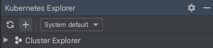
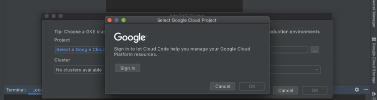
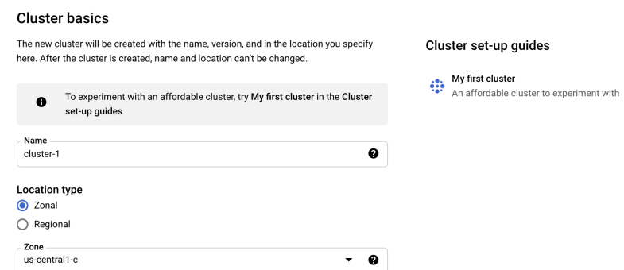
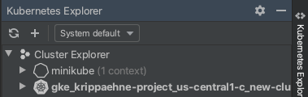

# Guestbook with Cloud Code

The Guestbook sample demonstrates how to deploy a Kubernetes application with a front end service and a back end service using the [Cloud Code extension for IntelliJ](https://cloud.google.com/code/docs/intellij/install?utm_source=ext&utm_medium=partner&utm_campaign=CDR_kri_gcp_cloudcodereadmes_012521&utm_content=-). When you run the application, Cloud Code uses [skaffold](https://skaffold.dev/docs/) under the hood to build an image and deploy the project's Kubernetes manifests. To learn more about Kubernetes, explore the [Kubernetes overview](https://kubernetes.io/docs/concepts/overview/). 

### Table of Contents
* [What's in this sample](#whats-in-this-sample)
  * [Kubernetes architecture](#kubernetes-architecture)
  * [Directory contents](#directory-contents)
  * [Skaffold modules](#skaffold-modules)
* [Getting Started](#getting-started)
    1. [Run the app locally with minikube](#run-the-app-locally-with-minikube)
        * [Edit run configuration](#edit-run-configuration)
        * [Run the app on minikube](#run-the-app-on-minikube)
    2. [Run the app remotely with Google Kubernetes Engine](#run-the-app-remotely-with-google-kubernetes-engine)
        * [Set up a GKE cluster](#set-up-a-gke-cluster)
        * [Deploy app to GKE](#deploy-app-to-gke)
    3. [Run individual services with Skaffold modules](#run-individual-services-with-skaffold-modules)
* [Next steps](#next-steps)
* [Sign up for User Research](#sign-up-for-user-research)
* [Getting support](#getting-support)

---
<h2 id="whats-in-this-sample"> What's in this sample </h2>

<h3 id="kubernetes-architecture"> Kubernetes architecture </h3>

<h3 id="directory-contents"> Directory contents </h3>

- `skaffold.yaml` - A schema file that serves as an entry point for all Skaffold modules in the app
- `src/frontend/` - Guestbook frontend service, containing the following config files:
  - `skaffold.yaml` - A schema file that defines the frontend Skaffold module ([skaffold.yaml reference](https://skaffold.dev/docs/references/yaml/))
  - `kubernetes-manifests/guestbook-frontend.deployment.yaml` - deploys a pod with the frontend container image
  - `kubernetes-manifests/guestbook-frontend.service.yaml` - creates a load balancer and exposes the frontend service on an external IP in the cluster

- `src/backend/` - Guestbook backend service, containing the following config files:
  - `skaffold.yaml` - A schema file that defines the backend Skaffold module ([skaffold.yaml reference](https://skaffold.dev/docs/references/yaml/))
  - `kubernetes-manifests/guestbook-backend.deployment.yaml` - deploys a pod with the backend container image
  - `kubernetes-manifests/guestbook-backend.service.yaml` - exposes the backend service on an internal IP in the cluster
  - `kubernetes-manifests/guestbook-mongodb.deployment.yaml` - deploys a pod containing a MongoDB instance
  - `kubernetes-manifests/guestbook-mongodb.service.yaml` - exposes the MongoDB service on an internal IP in the cluster

<h3 id="skaffold-modules"> Skaffold modules </h3>

  The Guestbook app uses Skaffold configuration dependencies, or **modules**, to define individual configurations for the frontend and backend services. Each module constitutes a single build-test-deploy pipeline that can be executed in isolation or as a dependency of another module. 

  Cloud Code enables iterative development and debugging on a single module or a subset of many modules, and makes editing the skaffold.yaml file configuration with modules easier. Underlying Skaffold takes care of module dependencies and their order of deployment.

  Guestbook runs both the frontend and backend modules by default. To run a single module, follow the steps in the section [Run individual services with Skaffold modules](#run-individual-services-with-skaffold-modules). 

---
<h2 id="getting-started"> Getting Started </h2>

<h3 id="run-the-app-locally-with-minikube"> Run the app locally with minikube </h3>

<h4 id="edit-run-configuration"> Edit run configuration </h4>

1. Click the configuration dropdown in the top taskbar and then click **Edit Configurations**.
   

   The **Develop on Kubernetes** configuration watches for changes, then uses [skaffold](https://skaffold.dev/docs/) to rebuild and rerun your app. You can customize your deployment by making changes to this run configuration or by creating a new Cloud Code: Kubernetes run configuration.

3. Under **Run > Deployment**, select 'Deploy locally to a minikube cluster'.
   

4. Click **OK** to save your configuration.

<h4 id="run-the-app-on-minikube"> Run the app on minikube </h4>

1. Select **Develop on Kubernetes** from the configuration dropdown and click the run icon. Cloud Code runs your app in a local [minikube](ttps://minikube.sigs.k8s.io/docs/start/) cluster.

2. View the build process in the output window. When the deployment is successful, you're notified that new service URLs are available. Click the Service URLs tab to view the URL(s), then click the URL link to open your browser with your running application.  
   

3. To stop the application, click the stop icon next to the configuration dropdown.

---
<h3 id="run-the-app-remotely-with-google-kubernetes-engine"> Run the app remotely with Google Kubernetes Engine </h3>

<h4 id="set-up-a-gke-cluster"> Set up a GKE cluster </h4>

1. Navigate to the Kubernetes Explorer from the right side panel, or by going to **Tools > Cloud Code > Kubernetes > View Cluster Explorer**. 

2. Click **+** to create a new cluster, or go to **Tools > Cloud Code > Kubernetes > Add GKE Cluster**.  

3. If prompted, log in to your GCP account and select a project.  

4. Click **Create a new GKE cluster**. You will be directed to the Google Cloud Console to create your new cluster.  

5. Once your GKE cluster has been created, it will be displayed in the Cluster Explorer.  

6. Your new cluster will be set as the current context by default. To switch contexts, right click on a different cluster in the Cluster Explorer and select **Set as Current Context**. 

<h4 id="deploy-app-to-gke"> Deploy app to GKE </h4>

1. Select **Develop on Kubernetes** from the configuration dropdown and click the run icon. 

2. View the build process in the output window. When the deployment is successful, you're notified that new service URLs are available. Click the Service URLs tab to view the URL(s), then click the URL link to open your browser with your running application.  

3. To stop the application, click the stop icon next to the configuration dropdown.

---
<h3 id="run-individual-services-with-skaffold-modules"> Run individual services with Skaffold modules </h3>

1. Go to **Run** > **Edit configurations** and open the **Build / Deploy** tab.

2. Select skaffold.yaml.

3. Choose **Build and deploy with** and select either the frontend or backend module. This tells Cloud Code to deploy only the selected service. You can select more than one module to deploy.

Note: The complete Guestbook app needs both services deployed to function properly, but for this tutorial we'll deploy one service to demonstrate running individual modules.

4. You can now run the selected module by deploying it to [minikube](#run-the-app-on-minikube) or [GKE](#deploy-app-to-gke). 

You can see how the Guestbook modules are defined by checking out the frontend's [skaffold.yaml](../../src/frontend/skaffold.yaml) and the backend's [skaffold.yaml](../../src/backend/skaffold.yaml).

For more info on how to use Skaffold modules, see the [Skaffold documentation](https://skaffold.dev/docs/design/config/#multiple-configuration-support).

---
<h2 id="next-steps"> Next steps </h2>

* Try [debugging your app](https://cloud.google.com/code/docs/intellij/kubernetes-debugging?utm_source=ext&utm_medium=partner&utm_campaign=CDR_kri_gcp_cloudcodereadmes_012521&utm_content=-) using Cloud Code
* Navigate the [Kubernetes Engine Explorer](https://cloud.google.com/code/docs/intellij/using-the-kubernetes-explorer?utm_source=ext&utm_medium=partner&utm_campaign=CDR_kri_gcp_cloudcodereadmes_012521&utm_content=-)
* Learn how to [edit YAML files](https://cloud.google.com/code/docs/intellij/yaml-editing?utm_source=ext&utm_medium=partner&utm_campaign=CDR_kri_gcp_cloudcodereadmes_012521&utm_content=-) to deploy your Kubernetes app
* [Configure an existing app](https://cloud.google.com/code/docs/intellij/using-a-k8-existing-app?utm_source=ext&utm_medium=partner&utm_campaign=CDR_kri_gcp_cloudcodereadmes_012521&utm_content=-) to run on Cloud Code
* Enable [Cloud APIs and client libraries](https://cloud.google.com/code/docs/intellij/client-libraries?utm_source=ext&utm_medium=partner&utm_campaign=CDR_kri_gcp_cloudcodereadmes_012521&utm_content=-)
* Manage secrets with [Secret Manager](https://cloud.google.com/code/docs/intellij/secret-manager?utm_source=ext&utm_medium=partner&utm_campaign=CDR_kri_gcp_cloudcodereadmes_012521&utm_content=-)

For more Cloud Code tutorials and resources, check out [Awesome Cloud Code](https://github.com/russwolf/awesome-cloudclode)!

---
<h2 id="sign-up-for-user-research"> Sign up for User Research </h2>

We want to hear your feedback!

The Cloud Code team is inviting our user community to sign-up to participate in Google User Experience Research. 

If you’re invited to join a study, you may try out a new product or tell us what you think about the products you use every day. At this time, Google is only sending invitations for upcoming remote studies. Once a study is complete, you’ll receive a token of thanks for your participation such as a gift card or some Google swag. 

[Sign up using this link](https://google.qualtrics.com/jfe/form/SV_4Me7SiMewdvVYhL?reserved=1&utm_source=In-product&Q_Language=en&utm_medium=own_prd&utm_campaign=Q1&productTag=clou&campaignDate=January2021&referral_code=UXbT481079) and answer a few questions about yourself, as this will help our research team match you to studies that are a great fit.

----

<h2 id="getting-support"> Getting support </h2>

If you encounter any bugs, confusing commands, or unclear documentation, you can file your feedback [directly on GitHub](https://github.com/GoogleCloudPlatform/cloud-code-intellij/issues).

If you'd like to propose a feature idea or have an open-ended discussion about a question you have with the Cloud Code team and the community, you can post on the [Cloud Code GitHub discussions forum](https://github.com/GoogleCloudPlatform/cloud-code-intellij/discussions).

Ask a question about Cloud Code on [Stack Overflow](http://stackoverflow.com/questions/tagged/cloud-code-intellij). Use the tag `google-cloud-intellij` for questions about Cloud Code. This tag not only receives responses from the Stack Overflow community, but also from Google engineers, who monitor the tag and offer unofficial support.
