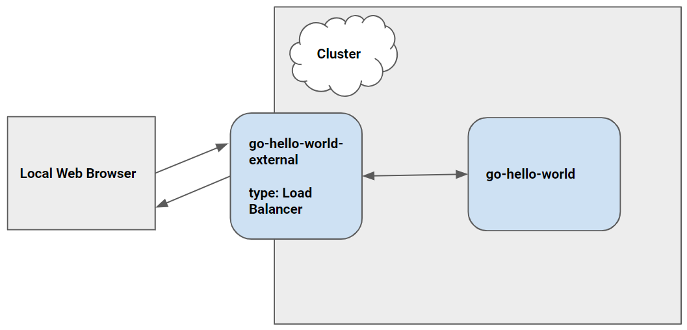

# Guestbook with Cloud Code

The Guestbook sample demonstrates how to deploy a Kubernetes application with a front end service and a back end service using the Cloud Code extension for Cloud Shell.

### Table of Contents
* [Getting Started](#getting-started)
    1. [Run the app locally with minikube](#run-the-app-locally-with-minikube)
    2. [Run the app remotely with Google Kubernetes Engine](#run-the-app-remotely-with-google-kubernetes-engine)
        * [Set up a GKE cluster](#set-up-a-gke-cluster)
        * [Deploy app to GKE](#deploy-app-to-gke)
* [Next steps](#next-steps)
* [Kubernetes Architecture Diagram](#kubernetes-architecture-diagram)

---

## Getting Started

### Run the app locally with minikube

1. To run your application, click on the Cloud Code status bar and select ‘Run on Kubernetes’.  

2. Select ‘Run locally using minikube’ when prompted. Cloud Code runs your app in a local Kubernetes cluster created using [minikube](https://minikube.sigs.k8s.io/docs/start/).

3. If prompted, authorize Cloud Shell to use your credentials to make a GCP API call.

4. View the build progress in the OUTPUT window. Once the build has finished, click on the front end service's URL in the OUTPUT window to view your live application.

5.  To stop the application, click the stop icon in the Debug Explorer.

### Run the app remotely on Google Kubernetes Engine

#### Set up a GKE cluster

1. From the command palette, run "Create GKE cluster".

2. Follow the steps to configure your cluster and click "Create Cluster". Once your cluster has been created, it will be displayed in the Google Kubernetes Engine Explorer.

3. Your new cluster will be set as the active cluster by default. To switch clusters, right click on a different cluster in the GKE Explorer and select “Set as Active Cluster”. 

#### Deploy app to GKE

1. Click on the Cloud Code status bar and select ‘Run on Kubernetes’.
2. If prompted, confirm the current context and image registry.

3. View the build’s progress in the OUTPUT window. Once the build has finished, you can visit your deployed app by clicking the URL in the OUTPUT window.

---
## Next steps
* [Configure an existing app to run on Cloud Code](https://cloud.google.com/code/docs/vscode/setting-up-an-existing-app)
* [Edit YAML files](https://cloud.google.com/code/docs/vscode/yaml-editing)
* [Use the Google Kubernetes Engine Explorer](https://cloud.google.com/code/docs/vscode/using-the-gke-explorer)
* [Manage Cloud APIs and client libraries](https://cloud.google.com/code/docs/vscode/client-libraries)
* [Manage secrets with Secret Manager](https://cloud.google.com/code/docs/vscode/secret-manager)
* [Debug the app](https://cloud.google.com/code/docs/vscode/debug)
* [View Container Logs](https://cloud.google.com/code/docs/vscode/logging)

---
## Kubernetes Architecture Diagram

----

