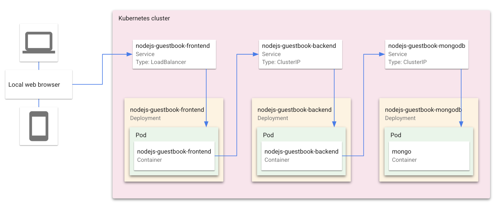

# Guestbook with Cloud Code

The Guestbook sample demonstrates how to deploy a Kubernetes application with a front end service and a back end service using the Cloud Code extension for Visual Studio Code. When you run the application, Cloud Code uses [skaffold](https://skaffold.dev/docs/) under the hood to build an image and deploy the project's Kubernetes manifests. To learn more about Kubernetes, explore the [Kubernetes overview](https://kubernetes.io/docs/concepts/overview/).

### Table of Contents
* [What's in this sample](#whats-in-this-sample)
  * [Kubernetes architecture](#kubernetes-architecture)
  * [Directory contents](#directory-contents)
  * [Skaffold modules](#skaffold-modules)
* [Getting Started](#getting-started)
    1. [Set up a Kubernetes cluster](#set-up-a-kubernetes-cluster)
        * [Minikube](#minikube) - free local cluster
        * [GKE](#GKE) - Google Kubernetes Engine
    2. [Deploy app to cluster](#deploy-app-to-cluster)
    3. [Run individual services with Skaffold modules](#run-individual-services-with-skaffold-modules)
* [Next steps](#next-steps)
* [Sign up for User Research](#sign-up-for-user-research)

---
## What's in this sample
### Kubernetes architecture


### Directory contents
- `skaffold.yaml` - A schema file that serves as an entry point for all Skaffold modules in the app
- `src/frontend/` - Guestbook frontend service, containing the following config files:
  - `skaffold.yaml` - A schema file that defines the frontend Skaffold module ([skaffold.yaml reference](https://skaffold.dev/docs/references/yaml/))
  - `kubernetes-manifests/guestbook-frontend.deployment.yaml` - deploys a pod with the frontend container image
  - `kubernetes-manifests/guestbook-frontend.service.yaml` - creates a load balancer and exposes the frontend service on an external IP in the cluster

- `src/backend/` - Guestbook backend service, containing the following config files:
  - `skaffold.yaml` - A schema file that defines the backend Skaffold module ([skaffold.yaml reference](https://skaffold.dev/docs/references/yaml/))
  - `kubernetes-manifests/guestbook-backend.deployment.yaml` - deploys a pod with the backend container image
  - `kubernetes-manifests/guestbook-backend.service.yaml` - exposes the backend service on an internal IP in the cluster
  - `kubernetes-manifests/guestbook-mongodb.deployment.yaml` - deploys a pod containing a MongoDB instance
  - `kubernetes-manifests/guestbook-mongodb.service.yaml` - exposes the MongoDB service on an internal IP in the cluster

### Skaffold modules

  The Guestbook app uses Skaffold configuration dependencies, or **modules**, to define individual configurations for the frontend and backend services. Each module constitutes a single build-test-deploy pipeline that can be executed in isolation or as a dependency of another module. 

  Cloud Code enables iterative development and debugging on a single module or a subset of many modules, and makes editing the skaffold.yaml file configuration with modules easier. Underlying Skaffold takes care of module dependencies and their order of deployment.

  Guestbook runs both the frontend and backend modules by default. To run a single module, follow the steps in the section [Run individual services with Skaffold modules](#run-individual-services-with-skaffold-modules). 

---
## Getting Started

### Set up a Kubernetes cluster

#### Minikube
 
 Cloud Code uses [minikube](https://minikube.sigs.k8s.io/docs/) to create a free local cluster.

1. Navigate to the **Clusters** explorer in the Cloud Code - Kubernetes sidebar using the left side Activity bar.

> Note: in newer versions of VS Code, the **Clusters** explorer has been replaced with a dedicated **Kubernetes** section.

2. Click '+' in the title bar of the Clusters explorer to create a new cluster. If prompted, follow the instructions to log in to Google Cloud Platform.  

3. Choose **Minikube** and then select **minikube**. 

2. Select **Start**. Cloud Code will initiate a minikube cluster.

#### Google Kubernetes Engine

1. Navigate to the **Clusters** explorer in the Cloud Code - Kubernetes sidebar using the left side Activity bar.

> Note: in newer versions of VS Code, the **Clusters** explorer has been replaced with a dedicated **Kubernetes** section.

2. Click '+' in the title bar of the Clusters explorer to create a new cluster. If prompted, follow the instructions to log in to Google Cloud Platform.  

3. Choose **Google Kubernetes Engine**. If you have existing clusters associated with your GCP project, you can select one from this dialog. To create a new cluster, click **+ Create a new GKE Cluster** and follow these steps:

    a. Choose **Standard** or **Autopilot**. For more information, see [Comparing Autopilot and Standard modes](https://cloud.google.com/kubernetes-engine/docs/concepts/autopilot-overview#comparison?utm_source=ext&utm_medium=partner&utm_campaign=CDR_kri_gcp_cloudcodereadmes_012521&utm_content=-).

    b. If prompted, click **Open** to permit Cloud Code to open the Cloud Console.

    c. In the Cloud Console, choose any configuration options that you want to customize and then click **Create**.

    d. Once the cluster has finished being created, return to VS Code and click **Refresh**.

    You can now select your newly created cluster.

8. The cluster you select will be added to the **Clusters** explorer and set as the default context. You can inspect the cluster's properties, make changes to the cluster's resources, and view logs by clicking the dropdown arrow next to the cluster name in the **Clusters** explorer.

### Deploy app to cluster

1. Navigate to the **Development Sessions** explorer in the **Cloud Code - Kubernetes** sidebar using the Activity bar on the left side of the IDE.

2. Click the 'Play' icon in the title bar of the **Development Sessions** explorer to run the application. If prompted, confirm the current context and image registry.

3. View the build progress in the **Development Sessions** explorer. Once the build has finished, the URLs for your deployed app will be displayed under **Port Forward URLs**. Click on the 'Open Window' icon next to the frontend service's URL to visit your deployed app.

4.  To stop the application, click the stop icon on the Debug Toolbar.

If you created a GKE cluster for this tutorial, be sure to delete your cluster to avoid incurring charges.

### Run individual services with Skaffold modules

The Guestbook app needs both services deployed to function properly, but for this tutorial we'll deploy only the frontend service to demonstrate running individual modules.

1. First, we need to deploy both services such that the backend will stay up after ending the development session.
  a. Open [.vscode/launch.json](../../.vscode/launch.json) and change the `cleanUp` property to `false`.
  b. Follow the steps above in "Deploy app to cluster" to deploy both services. When you click the stop icon to end the debug session, the services will remain deployed. (We'll leave `backend` running and only update `frontend`).

2. Open [.vscode/launch.json](../../.vscode/launch.json) and add the following code below the `skaffoldConfig` property:

```
      "skaffoldFlags": {
        "modules": [
          "frontend"
        ]
      },
```

This tells Cloud Code to build and deploy only the frontend module.

3. Click on the Cloud Code status bar and select **Run on Kubernetes**.

4. If prompted, confirm the current context and image registry.

5. View the build's progress in the OUTPUT window. Once the build has finished, you can view the deployed frontend module by clicking on the URL in the OUTPUT window.

6. Now, you can quickly iterate on the frontend service without having to rebuild and deploy the entire app for every change.
  a. Navigate to [frontend/views/home.pug](../../src/frontend/views/home.pug).
  b. Make a change to the file (e.g. "My Guestbook" > "My Frontend Guestbook").
  c. The frontend service will rebuild and you can see your changes in the deployed frontend service.

You can see how the Guestbook frontend module is defined by checking out the frontend's [skaffold.yaml](../../src/frontend/skaffold.yaml) file.

For more info on how to use Skaffold modules, see the [Skaffold documentation](https://skaffold.dev/docs/design/config/#multiple-configuration-support).

---
## Next steps
* Try [debugging your app](https://cloud.google.com/code/docs/vscode/debug?utm_source=ext&utm_medium=partner&utm_campaign=CDR_kri_gcp_cloudcodereadmes_012521&utm_content=-) using Cloud Code
* Navigate the [Kubernetes Engine Explorer](https://cloud.google.com/code/docs/vscode/using-the-gke-explorer?utm_source=ext&utm_medium=partner&utm_campaign=CDR_kri_gcp_cloudcodereadmes_012521&utm_content=-)
* Learn how to [edit YAML files](https://cloud.google.com/code/docs/vscode/yaml-editing?utm_source=ext&utm_medium=partner&utm_campaign=CDR_kri_gcp_cloudcodereadmes_012521&utm_content=-) to deploy your Kubernetes app
* [Configure an existing app](https://cloud.google.com/code/docs/vscode/setting-up-an-existing-app?utm_source=ext&utm_medium=partner&utm_campaign=CDR_kri_gcp_cloudcodereadmes_012521&utm_content=-) to run on Cloud Code
* Enable [Cloud APIs and client libraries](https://cloud.google.com/code/docs/vscode/client-libraries?utm_source=ext&utm_medium=partner&utm_campaign=CDR_kri_gcp_cloudcodereadmes_012521&utm_content=-)
* Manage secrets with [Secret Manager](https://cloud.google.com/code/docs/vscode/secret-manager?utm_source=ext&utm_medium=partner&utm_campaign=CDR_kri_gcp_cloudcodereadmes_012521&utm_content=-)

For more Cloud Code tutorials and resources, check out [Awesome Cloud Code](https://github.com/russwolf/awesome-cloudclode)!

---
## Sign up for User Research

We want to hear your feedback!

The Cloud Code team is inviting our user community to sign-up to participate in Google User Experience Research. 

If you’re invited to join a study, you may try out a new product or tell us what you think about the products you use every day. At this time, Google is only sending invitations for upcoming remote studies. Once a study is complete, you’ll receive a token of thanks for your participation such as a gift card or some Google swag. 

[Sign up using this link](https://google.qualtrics.com/jfe/form/SV_4Me7SiMewdvVYhL?reserved=1&utm_source=In-product&Q_Language=en&utm_medium=own_prd&utm_campaign=Q1&productTag=clou&campaignDate=January2021&referral_code=UXbT481079) and answer a few questions about yourself, as this will help our research team match you to studies that are a great fit.

----
