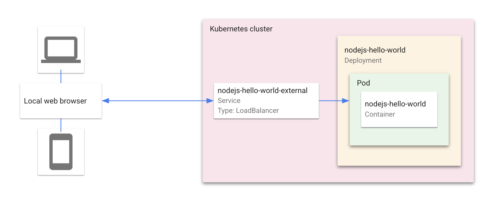

# Kubernetes Hello World with Cloud Code

"Hello World" is a Kubernetes application that contains a single
[Deployment](https://kubernetes.io/docs/concepts/workloads/controllers/deployment/) and a corresponding
[Service](https://kubernetes.io/docs/concepts/services-networking/service/). The Deployment contains a web server that renders a simple webpage.

For details on how to use this sample as a template in Cloud Code, read the documentation for Cloud Code for [VS Code](https://cloud.google.com/code/docs/vscode/quickstart-local-dev?utm_source=ext&utm_medium=partner&utm_campaign=CDR_kri_gcp_cloudcodereadmes_012521&utm_content=-) or [IntelliJ](https://cloud.google.com/code/docs/intellij/quickstart-k8s?utm_source=ext&utm_medium=partner&utm_campaign=CDR_kri_gcp_cloudcodereadmes_012521&utm_content=-).

### Table of Contents
* [Getting Started with VS Code](#getting-started-with-vs-code)
* [Getting Started with IntelliJ](#getting-started-with-intellij)
* [Kubernetes Architecture Diagram](#kubernetes-diagram)
* [Sign up for User Research](#sign-up-for-user-research)

---
## Getting Started with VS Code

### Run the app locally with minikube

1. To run your application, click on the Cloud Code status bar and select ‘Run on Kubernetes’.  
 

2. Select ‘Run locally using minikube’ when prompted. Cloud Code runs your app in a local [minikube](https://minikube.sigs.k8s.io/docs/start/) cluster.  

3. View the build progress in the OUTPUT window. Once the build has finished, click on the URL in the OUTPUT window to view your live application.  

4.  To stop the application, click the stop icon on the Debug Toolbar.

---
## Getting Started with IntelliJ

### Run the app locally with minikube

#### Start a minikube cluster
1. Navigate to the Kubernetes Explorer from the right side panel, or by going to **Tools > Cloud Code > Kubernetes > View Cluster Explorer**. 

2. If the Cluster Explorer is empty, go to the terminal and run 'minikube start'.  

3. Once minikube has started, it will be displayed in the Cluster Explorer. Minikube will be set as the current context by default. To switch contexts, right click on a different cluster in the Cluster Explorer and select 'Set as Current Context'.  

#### Run the app on minikube
1. Click the Run/Debug configurations dropdown on the top taskbar and select 'Edit Configurations'. Select 'Develop on Kubernetes'. You may need to specify your [container image repository](https://cloud.google.com/code/docs/intellij/configuring-container-image-settings?utm_source=ext&utm_medium=partner&utm_campaign=CDR_kri_gcp_cloudcodereadmes_012521&utm_content=-).  

2. Click 'OK' to save your configuration. 

3. Select 'Develop on Kubernetes' from the configuration drop down and click the run icon. Cloud Code runs your app in a local [minikube](ttps://minikube.sigs.k8s.io/docs/start/) cluster.  

4. View the build process in the output window. Once the build has finished, you will receive a notification from the Event Log. Click 'View' to access the local URLs for your deployed services. The URLs remain accessible through the Event Log dialog.  

5.  To stop the application, click the stop icon next to the configuration dropdown.

---
## Kubernetes Architecture Diagram

---
## Sign up for User Research

We want to hear your feedback!

The Cloud Code team is inviting our user community to sign-up to participate in Google User Experience Research. 

If you’re invited to join a study, you may try out a new product or tell us what you think about the products you use every day. At this time, Google is only sending invitations for upcoming remote studies. Once a study is complete, you’ll receive a token of thanks for your participation such as a gift card or some Google swag. 

[Sign up using this link](https://google.qualtrics.com/jfe/form/SV_4Me7SiMewdvVYhL?reserved=1&utm_source=In-product&Q_Language=en&utm_medium=own_prd&utm_campaign=Q1&productTag=clou&campaignDate=January2021&referral_code=UXbT481079) and answer a few questions about yourself, as this will help our research team match you to studies that are a great fit.
