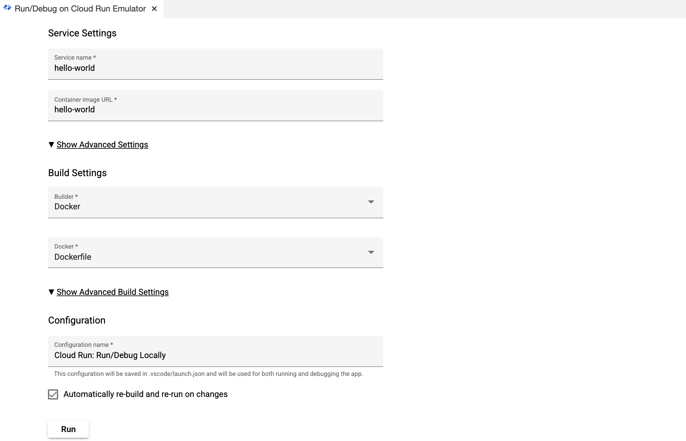
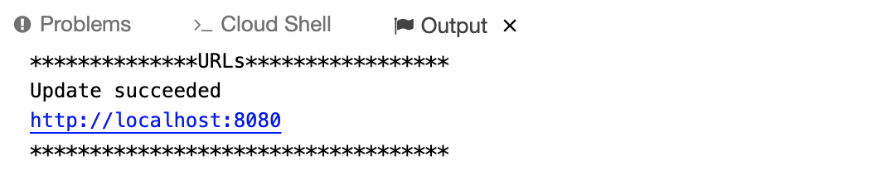
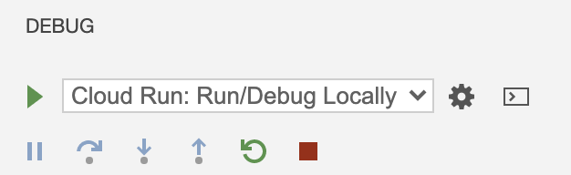
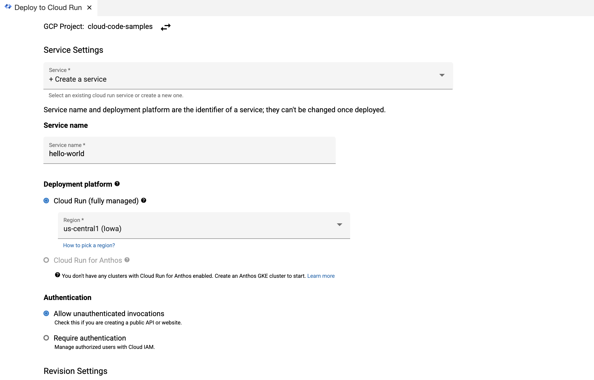
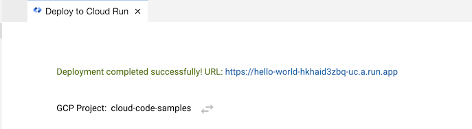

# Cloud Run Hello World with Cloud Code

This "Hello World" sample demonstrates how to deploy a simple "Hello World" application to Cloud Run using the Cloud Code extension for Cloud Shell.

### Table of Contents
* [Getting Started](#getting-started)
    1. [Run the app locally with the Cloud Run Emulator](#run-the-app-locally-with-the-cloud-run-emulator)
    2. [Deploy to Cloud Run](#deploy-to-cloud-run)
* [Next steps](#next-steps)

---
## Getting Started

### Run the app locally with the Cloud Run Emulator
1. Click on the Cloud Code status bar and select 'Run on Cloud Run Emulator'.

2. Use the Cloud Run Emulator dialog to specify your [builder option](https://cloud.google.com/code/docs/vscode/deploying-a-cloud-run-app#deploying_a_cloud_run_service). Cloud Code supports Docker, Jib, and Buildpacks. See the skaffold documentation on [builders](https://skaffold.dev/docs/pipeline-stages/builders/) for more information about build artifact types.  

3. Click ‘Run’. If prompted, authorize Cloud Shell to make GCP API calls.

4. View the build progress in the OUTPUT window. Once the build has finished, click on the URL in the OUTPUT window to view your live application.

5. To stop the application, navigate to the Debug window in the left side taskbar and click the stop icon.

### Deploy to Cloud Run

1. Select 'Deploy to Cloud Run' using the Cloud Code status bar.

2. If prompted, login to your Google Cloud account and set your project.
3. Use the Deploy to Cloud Run dialog to specify your build option and configure your deploy settings. For more information on the configuration options available, see [Deploying a Cloud Run app](https://cloud.google.com/code/docs/vscode/deploying-a-cloud-run-app).  

4. Click 'Deploy'. Cloud Code now builds your image, pushes it to the container registry, and deploys your service to Cloud Run.
5. View your live service by clicking on the URL displayed at the top of the 'Deploy to Cloud Run' dialog. 

---
## Next steps
* [Create a new Cloud Run app](https://cloud.google.com/code/docs/vscode/quickstart-cloud-run)
* [Use the Cloud Run Explorer](https://cloud.google.com/code/docs/vscode/cloud-run-explorer)
* [Manage Cloud APIs and client libraries](https://cloud.google.com/code/docs/vscode/client-libraries)
* [Manage secrets with Secret Manager](https://cloud.google.com/code/docs/vscode/secret-manager)
* [Debug the app](https://cloud.google.com/code/docs/vscode/debug)
* [View Container Logs](https://cloud.google.com/code/docs/vscode/logging)

---

