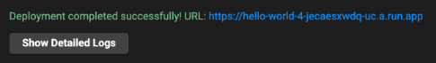

# Cloud Run Hello World with Cloud Code

This "Hello World" sample demonstrates how to deploy a simple "Hello World" application to Cloud Run using the Cloud Code extension for Visual Studio Code.

### Table of Contents
* [Getting Started](#getting-started)
    1. [Run the app locally with the Cloud Run Emulator](#run-the-app-locally-with-the-cloud-run-emulator)
    2. [Deploy to Cloud Run](#deploy-to-cloud-run)
* [Next steps](#next-steps)
* [Sign up for User Research](#sign-up-for-user-research)

---
## Getting Started

### Run the app locally with the Cloud Run Emulator
1. Click on the Cloud Code status bar and select 'Run on Cloud Run Emulator'.  

2. Use the Cloud Run Emulator dialog to specify your [builder option](https://cloud.google.com/code/docs/vscode/deploying-a-cloud-run-app#deploying_a_cloud_run_service?utm_source=ext&utm_medium=partner&utm_campaign=CDR_kri_gcp_cloudcodereadmes_012521&utm_content=-). Cloud Code supports Docker, Jib, and Buildpacks. See the skaffold documentation on [builders](https://skaffold.dev/docs/pipeline-stages/builders/) for more information about build artifact types.  

3. Click ‘Run’. Cloud Code begins building your image.

4. View the build progress in the OUTPUT window. Once the build has finished, click on the URL in the OUTPUT window to view your live application.  

5. To stop the application, click the stop icon on the Debug Toolbar.

### Deploy to Cloud Run

1. Select 'Deploy to Cloud Run' using the Cloud Code status bar.

2. If prompted, login to your Google Cloud account and set your project.

3. Use the Deploy to Cloud Run dialog to configure your deploy settings. For more information on the configuration options available, see [Deploying a Cloud Run app](https://cloud.google.com/code/docs/vscode/deploying-a-cloud-run-app?utm_source=ext&utm_medium=partner&utm_campaign=CDR_kri_gcp_cloudcodereadmes_012521&utm_content=-).  

4. Click 'Deploy'. Cloud Code now builds your image, pushes it to the container registry, and deploys your service to Cloud Run.

5. View your live service by clicking on the URL displayed at the top of the 'Deploy to Cloud Run' dialog.  

---
## Next steps
* Try [debugging your app](https://cloud.google.com/code/docs/vscode/debug?utm_source=ext&utm_medium=partner&utm_campaign=CDR_kri_gcp_cloudcodereadmes_012521&utm_content=-) using Cloud Code
* Navigate the [Cloud Run Explorer](https://cloud.google.com/code/docs/vscode/cloud-run-explorer?utm_source=ext&utm_medium=partner&utm_campaign=CDR_kri_gcp_cloudcodereadmes_012521&utm_content=-)
* Launch the [Log Viewer](https://cloud.google.com/code/docs/vscode/logging#cloud_run_logs?utm_source=ext&utm_medium=partner&utm_campaign=CDR_kri_gcp_cloudcodereadmes_012521&utm_content=-)
* Create a [Cloud Run for Anthos GKE cluster](https://cloud.google.com/code/docs/vscode/adding-an-anthos-gke-cluster?utm_source=ext&utm_medium=partner&utm_campaign=CDR_kri_gcp_cloudcodereadmes_012521&utm_content=-)
* Enable [Cloud APIs and client libraries](https://cloud.google.com/code/docs/vscode/client-libraries?utm_source=ext&utm_medium=partner&utm_campaign=CDR_kri_gcp_cloudcodereadmes_012521&utm_content=-)
* Manage secrets with [Secret Manager](https://cloud.google.com/code/docs/vscode/secret-manager?utm_source=ext&utm_medium=partner&utm_campaign=CDR_kri_gcp_cloudcodereadmes_012521&utm_content=-)

For more Cloud Code tutorials and resources, check out [Awesome Cloud Code](https://github.com/russwolf/awesome-cloudclode)!

---
## Sign up for User Research

We want to hear your feedback!

The Cloud Code team is inviting our user community to sign-up to participate in Google User Experience Research. 

If you’re invited to join a study, you may try out a new product or tell us what you think about the products you use every day. At this time, Google is only sending invitations for upcoming remote studies. Once a study is complete, you’ll receive a token of thanks for your participation such as a gift card or some Google swag. 

[Sign up using this link](https://google.qualtrics.com/jfe/form/SV_4Me7SiMewdvVYhL?reserved=1&utm_source=In-product&Q_Language=en&utm_medium=own_prd&utm_campaign=Q1&productTag=clou&campaignDate=January2021&referral_code=UXbT481079) and answer a few questions about yourself, as this will help our research team match you to studies that are a great fit.

----
