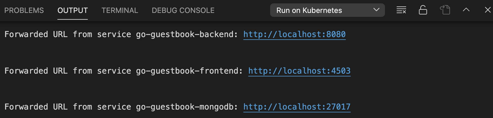
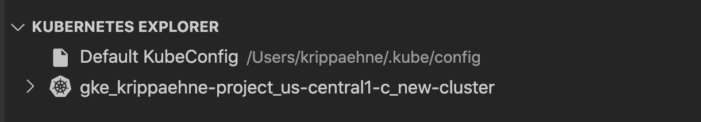

# Guestbook with Cloud Code

The Guestbook sample demonstrates how to deploy a Kubernetes application with a front end service and a back end service using the Cloud Code extension for Visual Studio Code.

### Table of Contents
* [Getting Started](#getting-started)
    1. [Run the app locally with minikube](#run-the-app-locally-with-minikube)
    2. [Run the app remotely with Google Kubernetes Engine](#run-the-app-remotely-with-google-kubernetes-engine)
        * [Set up a GKE cluster](#set-up-a-gke-cluster)
        * [Deploy app to GKE](#deploy-app-to-gke)
* [Next steps](#next-steps)
* [Kubernetes Architecture Diagram](#kubernetes-architecture-diagram)

---

## Getting Started

### Run the app locally with minikube

1. Start a local Kubernetes cluster by clicking on the minikube status bar (located next to the Cloud Code status bar) and selecting 'Start'. 

2. Click on the Cloud Code status bar and select 'Run on Kubernetes'. If prompted, select 'Use current context (minikube)'.

3. View the build progress in the OUTPUT window. Once the build has finished, click on the front end service's URL in the OUTPUT window to view your live application.

4.  To stop the application, click the stop icon on the Debug Toolbar.

### Run the app remotely on Google Kubernetes Engine

#### Set up a GKE cluster

1. Navigate to the Cloud Code - Kubernetes explorer using the left side taskbar.
2. In the Google Kubernetes Engine Explorer, click '+' to create a new Google Kubernetes Engine cluster. If prompted, follow the instructions to log in to Google Cloud Platform.

3. Follow the steps to configure your cluster and click "Create Cluster".
4. Once your GKE cluster has been created, it will be displayed in the Google Kubernetes Engine Explorer.
5. Your new cluster will be set as the active cluster by default. To switch clusters, right click on a different cluster in the GKE Explorer and select “Set Active Cluster”. 

#### Deploy app to GKE

1. Click on the Cloud Code status bar and select ‘Run on Kubernetes’.
2. If prompted, confirm the current context and image registry.
3. View the build’s progress in the OUTPUT window. Once the build has finished, you can visit your deployed app by clicking the URL in the OUTPUT window.

---
## Next steps
* [Configure an existing app to run on Cloud Code](https://cloud.google.com/code/docs/vscode/setting-up-an-existing-app)
* [Edit YAML files](https://cloud.google.com/code/docs/vscode/yaml-editing)
* [Use the Google Kubernetes Engine Explorer](https://cloud.google.com/code/docs/vscode/using-the-gke-explorer)
* [Manage Cloud APIs and client libraries](https://cloud.google.com/code/docs/vscode/client-libraries)
* [Manage secrets with Secret Manager](https://cloud.google.com/code/docs/vscode/secret-manager)
* [Debug the app](https://cloud.google.com/code/docs/vscode/debug)
* [View Container Logs](https://cloud.google.com/code/docs/vscode/logging)

---
## Kubernetes Architecture Diagram

----

