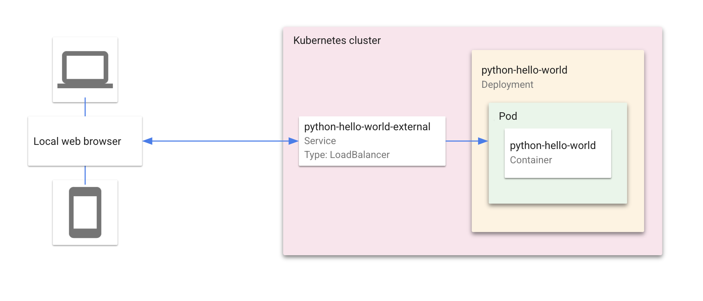

# Hello World with Cloud Code



"Hello World" is a simple Kubernetes application that contains a single
[Deployment](https://kubernetes.io/docs/concepts/workloads/controllers/deployment/) and a corresponding
[Service](https://kubernetes.io/docs/concepts/services-networking/service/). The Deployment contains a
[Flask-based](http://flask.pocoo.org/) web server that simply prints "Hello World".

----

# Table of Contents

## Cloud Code for Visual Studio Code
1. [Getting Started](#getting-started])
2. [What's in the box](https://cloud.google.com/code/docs/vscode/quickstart#whats_in_the_box)
3. Using Cloud Code
    * [Set up a Google Kubernetes Engine Cluster](https://cloud.google.com/code/docs/vscode/quickstart#creating_a_google_kubernetes_engine_cluster)
    * [Deploy the app](https://cloud.google.com/code/docs/vscode/quickstart#deploying_your_app)
    * [Continuous Deployment](https://cloud.google.com/code/docs/vscode/quickstart#initiating_continuous_deployment)
    * [View Container Logs](#view-container-logs)
    * [Debug Your Code](#debug-your-code)
    * [Open a Terminal in Your Container](#open-a-terminal-in-your-container)
    * [Tasks](#tasks)
4. [Using the Command Line](#using-the-command-line)
    * [Skaffold](#using-skaffold)
    * [kubectl](#using-kubectl)

----


## Getting Started
This sample was written to demonstrate how to use the Cloud Code extension for Visual Studio code.
* [Install Cloud Code for VS Code](https://cloud.google.com/code/docs/vscode/install)
* [Creating a new app](https://cloud.google.com/code/docs/vscode/creating-an-application)
* [Editing YAML files](https://cloud.google.com/code/docs/vscode/yaml-editing)


---

## Using the Command Line
As an alternative to using the Cloud Code extension, the application can be deployed to a cluster using standard command line tools

### Skaffold
[Skaffold](https://github.com/GoogleContainerTools/skaffold) is a command line tool that can be used to build, push, and deploy your container images as you work

```
skaffold run --default-repo=gcr.io/your-project-id-here/cloudcode
```

### kubectl

[kubectl](https://kubernetes.io/docs/tasks/tools/install-kubectl/) is the official Kubernetes command line tool. It can be used to deploy Kubernetes manifests to your cluster, but images must be build seperately using another tool (for example, using the [Docker CLI](https://docs.docker.com/engine/reference/commandline/cli/)) 

#### Build Container Images:
```
IMAGE_REPO="gcr.io/your-project-here/"
docker build -t $IMAGE_REPO/hello-world ./src
docker push $IMAGE_REPO/hello-world
```
#### Deploy Manifests
Note that you may need to edit hello.deployment.yaml's image field to match `$IMAGE_REPO/hello-world`
```
kubectl apply -f ./kubernetes-manifests
```
-----|------
